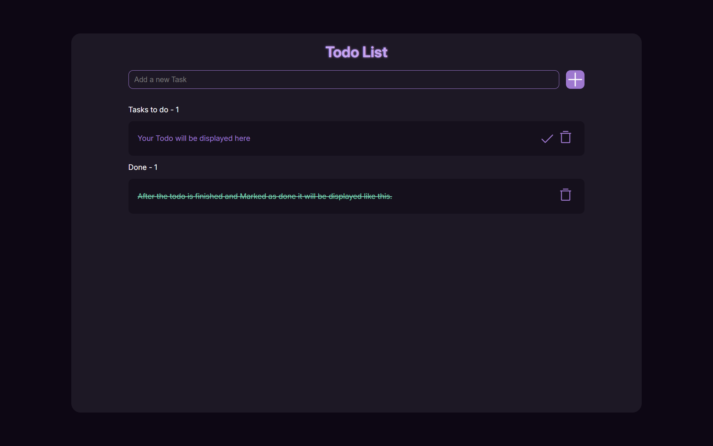

# # Todo App 📝

[Preview](https://todo-u3ut.onrender.com)

A simple and elegant **Todo App** built using **HTML**, **CSS**, and **Flask**. This app allows you to manage your tasks effortlessly, making your productivity a priority.

---

## Features ✨

- **Add Tasks**: Seamlessly add new tasks to your list.
- **Mark as Completed**: Stay organized by marking tasks as done.
- **Delete Tasks**: Keep your list clutter-free by removing completed or unwanted tasks.
- **Minimal Design**: A clean, responsive user interface for maximum focus.

---

## Installation 🚀

Follow these steps to get the app running on your local machine:

1. **Clone the repository**:
   ```bash
   git clone https://github.com/TheRealFarhanDev/Todo.git
   cd Todo
   ```

2. **Set up a virtual environment** (recommended):
   ```bash
   python -m venv venv
   On Windows: venv\Scripts\activate
   ```

3. **Install the requirements**:
   ```bash
   pip install -r requirements.txt
   ```

4. **Run the application**:
   ```bash
   python app.py
   ```

5. **Access the app**:  
   Open your browser and navigate to [http://127.0.0.1:5000](http://127.0.0.1:5000).

---

## Project Structure 📂

```
Todo/
├── app.py               # Main application file
├── requirements.txt     # Python dependencies
├── static/              # Static files (CSS, Images)
│   ├── style.css
│   └── assets/
├── templates/           # HTML templates
│   ├── index.html
│   └── base.html
└── README.md            # Project documentation
```

---

## Requirements 👋

All dependencies are listed in `requirements.txt`. Install them using:

```bash
pip install -r requirements.txt
```

---

## Download Link 🔗

[Download the Todo App from GitHub](https://github.com/TheRealFarhanDev/Todo/archive/refs/heads/main.zip)

---

## Design Reference 🎨

The design of this Todo App is inspired by a community project on Figma. Check out the design details here:  
[Todo App - Figma Design Reference](https://www.figma.com/design/IIiKjmxo0sW0YI8bYX8gLi/Todo-App-(Community)?m=auto&t=2T8MMOanVTDX1r0a-1)

---


## Screenshots 📸



---

### Author ❤️

Created with passion by [TheRealFarhanDev](https://github.com/TheRealFarhanDev).

---

